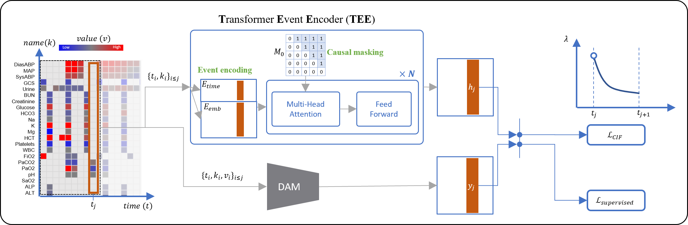

# [TEE4EHR: Transformer Event Encoder for Better Representation Learning in Electronic Health Records](https://arxiv.org/abs/2402.06367)

[](https://github.com/Y-debug-sys/Diffusion-TS/blob/main/LICENSE) 


> **Abstract:** Irregular sampling of time series in electronic health records (EHRs) is one of the main challenges for developing machine learning models. Additionally, the pattern of missing data in certain clinical variables is not at random but depends on the decisions of clinicians and the state of the patient. Point process is a mathematical framework for analyzing event sequence data that is consistent with irregular sampling patterns. Our model, *TEE4EHR*, is a transformer event encoder (TEE) with point process loss that encodes the pattern of laboratory tests in EHRs. The utility of our TEE has been investigated in a variety of benchmark event sequence datasets. Additionally, we conduct experiments on two real-world EHR databases to provide a more comprehensive evaluation of our model. Firstly, in a self-supervised learning approach, the TEE is jointly learned with an existing attention-based deep neural network which gives superior performance in negative log-likelihood and future event prediction. Besides, we propose an algorithm for aggregating attention weights that can reveal the interaction between the events. Secondly, we transfer and freeze the learned TEE to the downstream task for the outcome prediction, where it outperforms state-of-the-art models for handling irregularly sampled time series. Furthermore, our results demonstrate that our approach can improve representation learning in EHRs and can be useful for clinical prediction tasks.

<p align="center">
  
  <br>
  Architecture of TEE4EHR.
</p>

## Contents
- [Installation](#installation)
- [Datasets](#datasets)
- [Quick Start](#quick-start)
<!-- - [Citation](#citation) -->

## Installation
Clone the repository, create a virtual environment (`venv` or `conda`), and install the required packages using `pip`:
```bash
# clone the repository
git clone https://github.com/hojjatkarami/TimEHR.git
cd TimEHR

# using virtualenv
python3 -m venv test
source "test/bin/activate"

# using conda
conda create --name TimEHR python=3.9.7 --yes
conda activate TimEHR

# install the required packages
pip install -r requirements.txt
```


## Datasets
We used three real-world EHRs datasets as well as simulated data in our experiments:


| Dataset Name | Size | Number of Events |
|--------------|------|--------------------|
| [Stack Overflow (Multi-Class)](https://drive.google.com/drive/folders/1KIzJsiBlcH7k1hdGDxeW1Sg3dmzSERKH?usp=drive_link) | 6.6k | 22 |
| [Retweets (Multi-Class)](https://drive.google.com/drive/folders/0BwqmV0EcoUc8MVRvUEgtVmRaZ1U?resourcekey=0-86_dKFm2POj0hCqb8FVnpw&usp=drive_link) | 20k | 3 |
| [Retweets (Multi-Label)*](https://github.com/babylonhealth/neuralTPPs) | 24k | 3 |
| [Synthea (Multi-Label)*](https://github.com/babylonhealth/neuralTPPs) | 12k | 357 |
| [PhysioNet/Computing in Cardiology Challenge 2012 (P12)*](https://physionet.org/content/challenge-2012/1.0.0/) | 12k | 24 |
| [PhysioNet/Computing in Cardiology Challenge 2019 (P19)*](https://physionet.org/content/challenge-2019/1.0.0/) | 38k | 25 |

We converted the datasets (*) to the common format introduced by [Neural Hawkes Process](https://github.com/hongyuanmei/neurawkes). For P12 and P19 datasets, we used the same splits as in [RainDrop](https://github.com/mims-harvard/Raindrop/tree/main). You can download the converted datasets from [here](https://drive.google.com/drive/folders/1F92AZ2ct6Yzi5fpI0i6YpWJs-CdufG7j?usp=sharing).

If you want to use your own dataset, you need to convert it to the common format. You can do so by inspecting one of the datasets.


## Quick Start

We highly recommend using `wandb` for logging and tracking the experiments. Get your API key from [wandb](https://wandb.ai/authorize). Create a `.env` file in the root directory and add the following line:

```bash
WANDB_API_KEY=your_api_key
```

First, you need to convert your irregularly-sampled time series data into a desired format. Then, run the following command to train the model:

```bash
python Main.py  -data /mlodata1/hokarami/tedam/p12/ -setting raindrop -split 0 -demo -data_label multilabel -wandb -wandb_project TEEDAM_supervised -event_enc 1 -state -mod ml -next_mark 1 -mark_detach 1 -sample_label 1 -user_prefix [H70--TEDA__pp_ml-concat] -time_enc concat -wandb_tag RD75

```

The results will be logged in the `wandb` dashboard under `TEEDAM_supervised` project.


# Replication of the results in the paper

To replicate the results in the paper (Tables 2-5), please run the following scripts:


```bash
bash scripts/preliminary/{DATA}.sh # Tables 2, 3
bash scripts/EHRs/Unsupervised/{DATA}.sh # Table 4
bash scripts/EHRs/Supervised/{DATA}.sh # Table 5
```


## Citation
If you find this repo useful, please cite our paper via
```bibtex
@article{karami2024tee4ehr,
  title={TEE4EHR: Transformer Event Encoder for Better Representation Learning in Electronic Health Records},
  author={Karami, Hojjat and Atienza, David and Ionescu, Anisoara},
  journal={arXiv preprint arXiv:2402.06367},
  year={2024}
}
```


